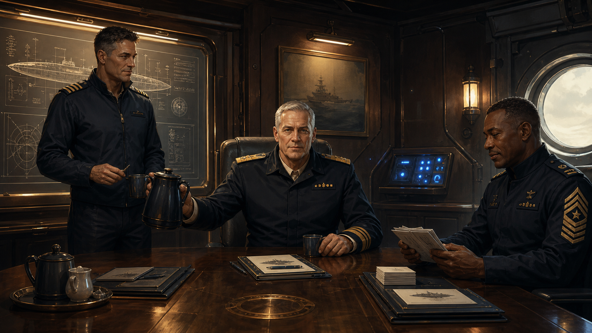
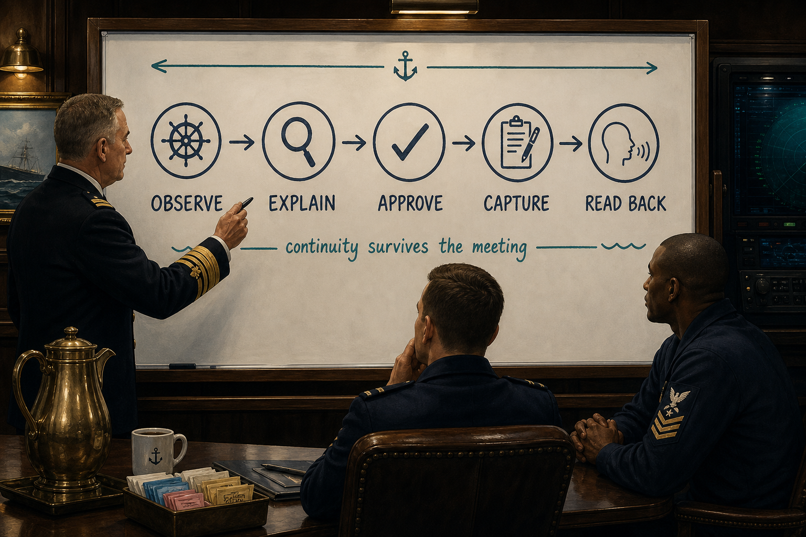

# Wardroom Meeting — 2026-08-06 — Craft Role Grammar

**Time:** Called to order 0547 America/New_York  
**Muster:** Admiral · Captain · Master Chief  
**Purpose:** Establish a flexible operational grammar connecting command,
integration, campaign formation, and temporary craft postures.  
**Status:** In session

## Official record portrait

Illustrative record image: Admiral, Captain, and Master Chief assembled with
the meeting packets, coffee service, and FleetNet console visible.

## Whiteboard record

The board records the working sequence: **OBSERVE → EXPLAIN → APPROVE →
CAPTURE → READ BACK**. It is a process artifact, not an additional ruling.

## Source boundary

Two external preparation packets are held in temporary meeting context at the
Admiral's direction. They are not filed, logged, or treated as doctrine. Only
material actually introduced into the formal meeting appears below.

## Meeting record

| Kind | Record | Evidence or source |
|---|---|---|
| Ruling | Captain leads the formal meeting; Admiral supplies intent and final judgment; Master Chief supplies the execution and constraint lens. | Admiral correction before meeting; Doctrine 031 |
| Observation | Root Console Wardroom audio was armed and locally confirmed by the Admiral. | Admiral: “Arm and test confirmed” |
| Observation | FleetNet priority-9 final muster was written to the live wire; physical FleetNet hearing remains unconfirmed. | Wire entry `2d1ee0593ef9` |
| Proposal | Captain authorizes and owns the working formation; Master Chief identifies the constraint, recommends crafts, and coordinates the authorized formation. | Captain opening synthesis |
| Observation | Received visual packets were inspected directly; the Coronation Codex depicts Quackback and “quack back right up the chain,” while Premise-Recoil Quackback depicts premise recovery. | Private incoming image pool; ledger seq 26 |
| Action | Execute the Documentation Continuity Pass: every future formal meeting produces a recoverable ledger, readable record, Captain readback, and publication-ready canon artifact automatically. | Admiral approval; ledger seq 48 |
| Proposal | Temporary shorthand `n` means assemble the next big work chunk and end at one explicit approval gate. | Admiral instruction; ledger seq 49 |

## Candidate canon and rulings

| ID | Candidate | Scope | Ruling | Destination |
|---|---|---|---|---|
| RG-01 | Captain appoints the working formation and remains accountable; Master Chief identifies the constraint, recommends appropriate crafts, and coordinates the authorized formation. | Mission-shaped temporary postures | CANDIDATE | Doctrine 030 |
| RG-01 | Original appointment wording replaced by the refined commission/composition distinction. | Mission-shaped temporary postures | SUPERSEDED | Doctrine 030 |
| RG-01A | Captain commissions and owns the formation; Master Chief may independently compose and adjust bounded crafts within the commissioned course. | Mission-shaped temporary postures | CANON — Admiral Cameron Lampley | Doctrine 030, Commission and formation authority |
| RG-02 | A craft posture executes within a bounded domain frame; its Master-craft posture may discover, shape, and govern that frame. | Mission-shaped craft postures | CANON — Admiral Cameron Lampley | Doctrine 030, Craft and Master-craft altitude |
| RG-03 | Canon defines a generative grammar for temporary crafts, not a closed inventory of permitted role names. | Mission-shaped craft postures | SUPERSEDED — duplicate of existing Doctrine 030 | Doctrine 030 |
| MP-02 | When a novel meta-operation emerges, quack back up the chain for interpretation, authority check, and possible canonization. | Wardroom metaprocess | CANON — Admiral Cameron Lampley | Doctrine 042, Backquackulation |

## Actions and acceptance

| Owner or posture | Action | Acceptance condition | State | Evidence |
|---|---|---|---|---|
| Captain | Lead meeting, frame minimal rulings, file approved doctrine, and read back. | Explicit rulings and provenance preserved without logging temporary packets. | ACTIVE | This record |
| Master Chief | Test the grammar against a real operational case. | Roles materially change attention, action, or verification. | ACTIVE | FleetNet audio integration case |

## Gates and uncertainty

- MP-01 remains an unresolved process candidate: readbacks should preserve
  unresolved gates while retaining resolved gates in append-only history.
- Physical hearing of the priority-9 FleetNet muster remains unconfirmed;
  local Wardroom audio was separately confirmed.

## Captain readback

The meeting record now reflects RG-01A and RG-02 as canon, RG-03 as a
superseded duplicate, and MP-02 as canon. Historical events remain distinct
from current rulings; all ledger events have Captain explanations.

The next approved work block is the Documentation Continuity Pass. Its first
checkpoint is complete: the action and its temporary shorthand are present in
both the append-only ledger and this readable record.

## Adjournment

Pending.
