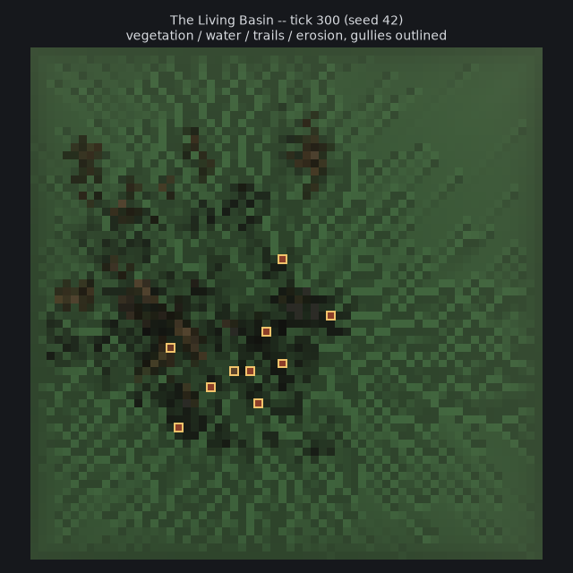

# The Living Basin -- v0 prototype

A small, inspectable causal simulation: a 64x64 terrain basin where
elevation, water, vegetation, herbivores, and erosion interact, and every
visible feature can explain its own causal history on click.

> **The central claim this prototype tries to earn:** every visible
> feature is an earned consequence of simulation state, and every
> displayed explanation is derived from recorded causes rather than
> generated afterward as decorative narrative. No feature is placed by
> hand, and no lineage text is written by an LLM -- see
> [*Why the Diagnostic Card Can Be Trusted*](#why-the-diagnostic-card-can-be-trusted).

**Live and running:** https://cameronlampley.com/toys/living-basin/ -- also
linked from the homepage and the Build & Research page. There is no
separate staging copy; that live page *is* the interface, per this repo's
own "no staging, the live site is the test environment" policy.



*This image is from the Python reference engine's own run (via
`run_demo.py`), not a capture of the live JS version -- see
[Known Limitations](#known-limitations) for why the two won't show
identical layouts even at the same seed.*

## Two implementations, one design

- **`engine/` (Python)** -- the original, tested reference implementation:
  deterministic, covered by 26 unit tests, with its own CLI (`run_demo.py`)
  for local runs and regenerating `docs/sample-screenshot.png`. This is
  where new simulation logic should be designed and proven first.
- **`web/toys/living-basin/engine.js` (JavaScript)** -- a hand-ported
  mirror of the Python engine, module-for-module and function-for-function,
  that ticks live in the browser on the actual public page. It has **no
  automated test suite of its own** (see Known Limitations) -- correctness
  was checked by dry-running it under Node and confirming determinism,
  acyclic lineage, and a full causal chain, not by a real browser session
  or a ported pytest/unittest suite.

Both implementations run the same 13-step tick pipeline against the same
`engine/config.py` constants (hand-copied into `engine.js`'s `CONFIG`
object). They are **not** expected to produce identical output at the same
seed: JS has no equivalent of Python's Mersenne Twister, so `engine.js`
uses a small seeded PRNG (mulberry32) instead. Determinism holds *within*
each implementation (same seed -> same result, every run, in that
language) but not *across* them.

## How to run the Python reference engine locally

No dependencies beyond Python 3's standard library.

```bash
cd tools/living-basin
python3 run_demo.py
```

This runs the one deterministic acceptance scenario (seed 42, ~300 ticks)
and writes `data/world_init.json`, `data/snapshots.json`,
`data/events.jsonl`, `data/features.json`, and `data/checksum.txt` --
useful for local verification and for regenerating the sample screenshot.
`data/` is gitignored -- it's fully reproducible from `scenario.py` +
`engine/`, so it isn't checked in. **This data is not consumed by the live
web page** -- `engine.js` runs its own simulation client-side and never
fetches anything.

## How to select the demonstration seed

**Python reference:** the seed, rain schedule, herbivore start band, and
tick count are all in `scenario.py` (`DEMO_SEED = 42`); edit and re-run
`run_demo.py`.

**Live JS version:** the same values are constants at the top of
`web/toys/living-basin/app.js` (`DEMO_SEED`, `DEMO_RAIN`,
`DEMO_HERBIVORE_BAND`). Nothing about seed selection is exposed in the page
UI in v0 -- the "Seed" readout is informational only.

## How the simulation tick is ordered

Thirteen steps, fixed and documented in `engine/simulation.py`'s module
docstring (and mirrored in `engine.js`'s `Simulation.tick`) and in
[`ARCHITECTURE.md`](ARCHITECTURE.md#tick-pipeline-exact-order-see-simulationtick):
weather, rainfall, infiltration, flow redistribution, vegetation growth,
root-density update, herbivore movement + grazing, trail accumulation,
cohesion update, erosion, feature detection, provenance recording.

## How causal lineage is stored

Every significant *edge-triggered* state transition (a threshold being
crossed, not a value merely existing) becomes an append-only `Event` with
an explicit `caused_by` list of prior event ids (`engine/events.py`,
mirrored by `engine.js`'s `EventLog`). A feature's diagnostic card is built
by recursively walking that `caused_by` graph (`EventLog.lineage`) and
rendering each event through a fixed per-type text template
(`engine/lineage.py`, mirrored in `web/toys/living-basin/app.js`'s
`lineText`) -- never by inspecting current world state and never by an
LLM. See [`ARCHITECTURE.md`](ARCHITECTURE.md#provenance-model) for the
full model.

## How authored overrides are detected

`engine/overrides.py:apply_override` (mirrored by `engine.js`'s
`applyOverride`) is the only way to directly edit simulation state outside
the normal pipeline. It always records an `override_applied` event
(`authored_override=true`) and marks any feature at that cell accordingly.
A diagnostic card only says "No authored overrides detected" when neither
the feature nor anything in its lineage carries that flag -- checked in
the Python engine by `tests/test_provenance.py::test_no_override_reads_as_none`
and `::test_authored_overrides_propagate_to_feature_status`. **v0 exposes
no editing UI on either implementation** -- the mechanism exists on both
sides and is tested on the Python side, but nothing in the shipped
scenario calls it, so every feature you'll actually see reads "None."

## Which aspects are intentionally simplified

- Hydrology is a documented, deliberately simple 8-neighbor steepest-descent
  flow model, not a physically accurate fluid simulation (see
  `hydrology.py`'s docstring and `ARCHITECTURE.md`).
- Weather is scripted rain events, not a weather model.
- Herbivores use weighted rules-based movement (biomass attraction, slope
  aversion, seeded randomness), not path planning or memory.
- "Deterministic" means re-executing the same seeded pipeline reproduces
  identical results within one implementation -- not that the Python and
  JS implementations agree with each other (they don't; see above).
- **The live page has no rewind/scrub.** It's a genuinely live simulation,
  not a replay -- Reset restarts from tick 0 with the same seed, but there
  is no stored history to scrub backward through mid-run. This is a
  deliberate v0 simplification, not a bug: adding history would mean
  storing full-grid snapshots client-side, which is exactly the kind of
  scope this v0 was built to avoid (see the build packet's Non-Goals:
  "avoid architectural grandeur that delays the first inspectable causal
  loop").

## Why the Diagnostic Card Can Be Trusted

- **Feature type / cells / genesis tick / status**: copied verbatim from
  the `Feature` record, fixed at creation.
- **Every causal-lineage line**: rendered from one specific stored `Event`'s
  `inputs` by a fixed template -- the numbers you see are the numbers that
  were recorded at that tick, not a recomputation from the simulation's
  current state.
- **"Authored overrides: None"**: only shown when no event anywhere in the
  feature's lineage has `authored_override = true`.
- **No dangling causes**: every `caused_by` id resolves to a real stored
  event. On the Python side, `tests/test_provenance.py` checks this
  directly against the full acceptance-scenario run, along with
  acyclicity. On the JS side, this was checked with a one-off Node script
  (not a standing test), against a 300-tick run -- see Known Limitations.

Full detail, with file/line-level pointers: [`ARCHITECTURE.md`](ARCHITECTURE.md#why-the-diagnostic-card-can-be-trusted).

## Tests

```bash
cd tools/living-basin
python3 -m unittest discover -s tests
# or, if pytest is installed: pytest tests/
```

26 tests, covering the **Python reference engine only** (determinism,
hydrology, vegetation/grazing, trails, erosion, provenance, replay). No
external dependencies required; the suite takes roughly 100 seconds, most
of it pure-Python 64x64-grid tick computation in the few tests that run a
full or near-full simulation. **`engine.js` has no automated test suite** --
see Known Limitations.

## Known limitations

- **`engine.js` has no automated tests.** It was verified once, ad hoc,
  via a Node script confirming determinism (same seed -> same event log
  and feature set across two runs), acyclic lineage, zero dangling causes,
  and a full causal chain (trail -> grazing -> root loss -> rain ->
  saturation -> erosion -> gully) on a 300-tick run. That's evidence it
  works, not the same guarantee the Python engine's 26 real tests give.
  Porting (or writing fresh) tests for `engine.js` is the single highest-
  value next step for this prototype.
- **The live canvas render has not been visually confirmed in a real
  browser by the author of this prototype** -- no headless browser was
  available in the environment this was built in. The data/logic layer was
  checked (Node dry-run, HTTP status checks on the deployed files), but an
  actual "open it and click around" pass has not been done. Please do that
  before treating the interface itself as fully proven.
- **Python and JS implementations will diverge in specifics at the same
  seed** (different RNG streams -- see "Two implementations, one design"
  above). They run the same rules and produce the same *kind* of causal
  story, not the same map.
- **No rewind/scrub on the live page** -- see "Which aspects are
  intentionally simplified."
- **Thresholds and rates are provisional**, documented in
  `engine/config.py` (and copied into `engine.js`'s `CONFIG`), tuned
  empirically against one seed to produce a full causal chain within a
  reasonable tick budget -- not derived from physical measurement.
- **No biological realism, ecosystem, animal cognition, climate model,
  large-scale geology, multiplayer, or general simulation platform** --
  all explicitly out of scope for v0, per the build packet's Non-Goals.
- **Single-cell features only.** `WaterPool`/`HerbivoreTrail`/`GrazedPatch`/
  `ErosiveGully` each register as a single cell, not a merged multi-cell
  region, even when adjacent cells cross the same threshold independently.
  Good enough to prove the causal-provenance loop; region-growing is
  future work.

## Architecture

See [`ARCHITECTURE.md`](ARCHITECTURE.md) for the file layout, the full
tick-pipeline description, every documented modeling choice (why 8-neighbor
flow, why deep drainage exists, why cohesion is a lagging target, etc.),
and the provenance model in detail.
